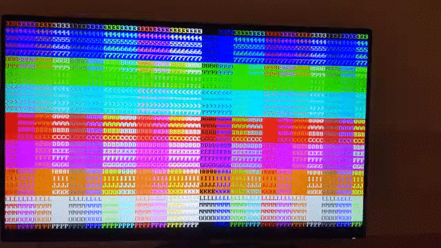

# hdmi

[English](./README.md) | [Français](./README_fr.md) | [Nous aider avec la traduction](https://github.com/hdl-util/hdmi/issues/11)

SystemVerilog code pour transmettre vidéo/audio HDMI 1.4a sur un [FPGA](https://fr.wikipedia.org/wiki/Circuit_logique_programmable#FPGA).

## Pourquoi?

La plupart des implementations open source d'un source HDMI transmettre en réalité un signal DVI, avec qui les sinks HDMI (i.e. TVs/moniteurs) sont rétrocompatible. Pour supporter audio et l'autre HDMI seulement fonctionnalité, on doit transmettre un signal HDMI vrai. Le code dans ce dépôt permettez-vous de faire ça sans licencer un bloc HDMI IP de n'importe qui.

### Démo: Mode texte VGA-compatible, 720x480p sur un Moniteur Dell Ultrasharp 1080p

## Usage

1. Take files from `src/` and add them to your own project. If you use [hdlmake](https://hdlmake.readthedocs.io/en/master/), you can add this repository itself as a remote module.
1. Other helpful modules for displaying text / generating sound are also available in this GitHub organization.
1. Consult the simple usage example in `top/top.sv`.
1. See [hdmi-demo](https://github.com/hdl-util/hdmi-demo) for code that runs the demo as seen the demo GIF.
1. Read through the parameters in `hdmi.sv` and tailor any instantiations to your situation.
1. Please create an issue if you run into a problem or have any questions. Make sure you have consulted the troubleshooting section first.

S'il vous plaît regarder le readme anglais pour l'information à jour.
